# Cardiovascular Disease Prediction

## Overview

Cardiovascular diseases (CVDs) are the leading cause of death globally, taking an estimated 17.9 million lives each year(https://www.who.int/health-topics/cardiovascular-diseases#tab=tab_1). CVDs are a group of disorders of the heart and blood vessels and include coronary heart disease, cerebrovascular disease, rheumatic heart disease and other conditions. More than four out of five CVD deaths are due to heart attacks and strokes.Identifying those at high risk of Cardiovascular disease and ensuring they receive appropriate treatment can prevent premature deaths. 

## Business Understanding

Major cause for cardiovascular disease are High level of gulcose, cholesterol, BMI, blood pressure and so on. This project predicts whether a person has cardiovascular disease or not using different classification model.

## Approach

We will follow the OSEMN (Obtain-Scrub-Explore-Model-Interpret)process for this project.

- checking for null values and duplicates
- dropping ID column
- changing age from days to years
- heights and weights that seemed too high or too low
- systolic or diastolic pressure readings that were negative, unusually low, or diastolic was lower than systolic
- adding new BMI column
- one hot encoding of cholesterol and glucose column

## Data

The data used for this project was obtained from Kaggle.The data contains 12 features and 1 target. It is a larger dataset with 70,000 entries. The target variable is balanced. It consist of 7 categorical features including the target variable.

### Data description

There are 3 types of input features

- Objective: factual information
- Examination: results of medical examination
- Subjective: information given by the patient

### Features

- Age | Objective Feature | age | int (days)
- Height | Objective Feature | height | int (cm)
- Weight | Objective Feature | weight | float (kg)
- Gender | Objective Feature | gender | categorical code
- Systolic blood pressure | Examination Feature | ap_hi | int
- Diastolic blood pressure | Examination Feature | ap_lo | int
- Cholesterol | Examination Feature | cholesterol | 1: normal, 2: above normal, 3: well above normal
- Glucose | Examination Feature | gluc | 1: normal, 2: above normal, 3: well above normal
- Smoking | Subjective Feature | smoke | binary
- Alcohol intake | Subjective Feature | alco | binary
- Physical activity | Subjective Feature | active | binary
- Presence or absence of cardiovascular disease | Target Variable | cardio | binary

### Explore

### Age Analysis

Age column were converted from days to years.  we converted Ages into specific age categories. people's age ranging from 50 - 60 has more number of cardiovascular disease. people with the age between 30 - 40 are less likely affected from the disease.

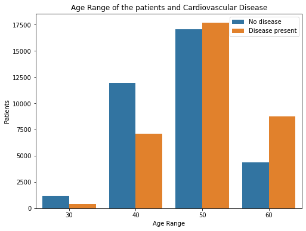

### Cholesterol

people with above normal and well above normal condition are highly affected by cardiovascular disease.Cholesterol levels "above normal" and "well above normal" increase an chance of being diagnosed with cardiovascular disease. However, having "normal" cholesterol levels does not decrease your chances. There are many people with normal cholesterol levels and affected by cardiovascular disease.

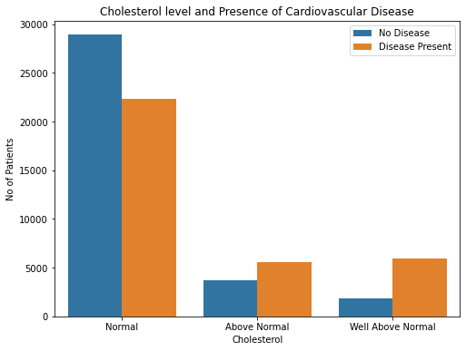

### Glucose

Glucose is the main type of sugar in the blood and is the major source of energy for the body's cells. Those with glucose levels "Above normal" or "Well above normal" were diagnosed with CVD more often than with normal glucose level.

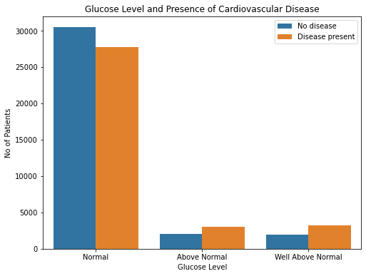

### BMI

Body mass index (BMI) is a measure of body fat based on height and weight that applies to adult men and women.

BodyMassIndex(BMI)

- Weight BMI

- Under weight <18.5
- Healthy weight 18.5 - 24.9
- Overweight 25 - 29.9
- Obese

- Type 1 30 - 34.9
- Type 2 35 - 39.9
- Type 3. >=40

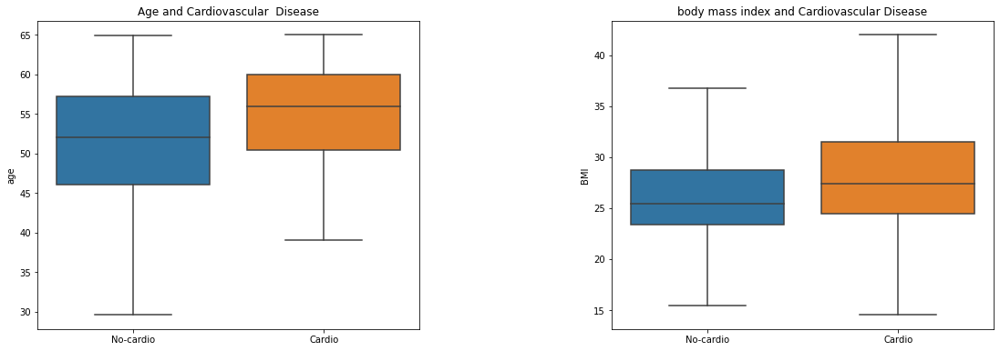

Individual with higher body mass index is affected with cardiovascular disease. BMI plays an important role in heart disease.

### Modeling

The data was split into training and testing data and the training data was scaled using Standard Scaler.

- The models were built without any hyperparameter tuning. These models include:

- Logistic Regression
- Random Forest
- K-Nearest Neighbor
- Decision Tree
- XGBoost

The models were run and their results saved into a DataFrame.

Then each model was tuned using hyperparameters to see if the accuracy, F1 score, and false negatives could be improved. That data would be again saved into a DataFrame to compare all models. 

### Logistic Regression

GS Logistic Regression Classification Report
              precision    recall  f1-score   support

           0       0.75      0.63      0.69      6843
           1       0.68      0.79      0.73      6840

    accuracy                           0.71     13683
    
   macro avg       0.72      0.71      0.71     13683
   
weighted avg       0.72      0.71      0.71     13683

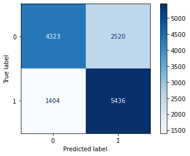

### Decision Tree 

RS Decision Tree Classification Report
              precision    recall  f1-score   support

           0       0.72      0.72      0.72      6843
           1       0.72      0.72      0.72      6840

    accuracy                           0.72     13683
    
   macro avg       0.72      0.72      0.72     13683
   
weighted avg       0.72      0.72      0.72     13683

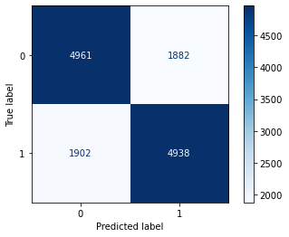

### XG Boost

RS XGBoost Classification Report
              precision    recall  f1-score   support

           0       0.76      0.64      0.69      6843
           1       0.69      0.80      0.74      6840

    accuracy                           0.72     13683
    
   macro avg       0.72      0.72      0.72     13683
   
weighted avg       0.72      0.72      0.72     13683

### Random Forest

RS Random Forest Classification Report
              precision    recall  f1-score   support

           0       0.74      0.68      0.71      6843
           1       0.70      0.76      0.73      6840

    accuracy                           0.72     13683
    
   macro avg       0.72      0.72      0.72     13683
   
weighted avg       0.72      0.72      0.72     13683

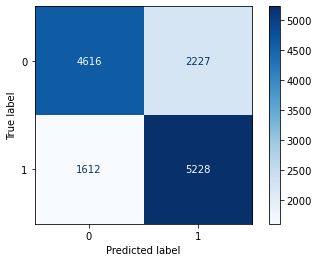

### KNN

GS KNN Classification Report
              precision    recall  f1-score   support

           0       0.71      0.75      0.73      6843
           1       0.73      0.69      0.71      6840

    accuracy                           0.72     13683
    
   macro avg       0.72      0.72      0.72     13683
   
weighted avg       0.72      0.72      0.72     13683

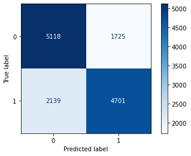

### ROC Curve

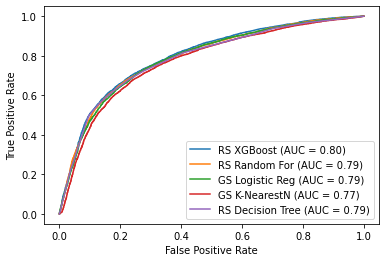

While most of the tuned models perform similarly, the tuned XGBoost again slightly outperforms the other models.

### Interpret

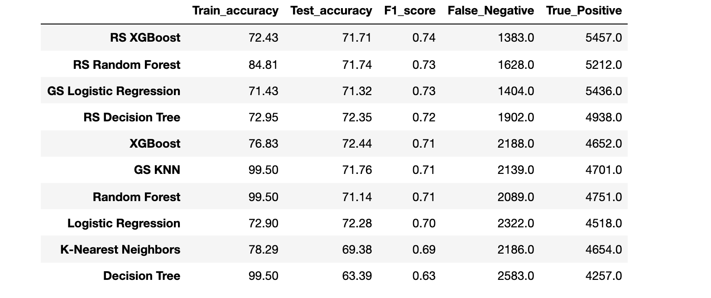

Looking at F1 score (conveys the balance between the precision and the recall) and false negatives are so important to this prediction. We can see that the hyperparameter tuned XG Boost model was able to predict the most True Positive and fewest false negatives. It has the highest F1 score and testing and training accuracy are very similar.

### Feature Importance 

The systolic reading is by far the most important feature in predicting cardiovascular disease. Having a cholesterol well above normal, and a person's age are the second and third most important features, respectively.

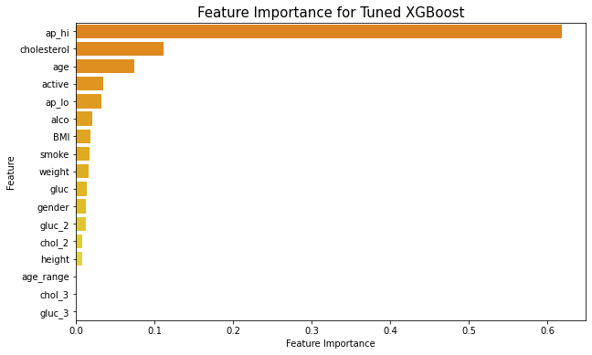

## Conclusion

The model that performed the best overall was XGBoost with tuned hyperparameters.Due to it's highest true positive and lowest false negative rates as well as the highest F1 score. It may not have been the most accurate model that was made, but was fairly close (by less than 2%).
This model also had the highest AUC (Area Under the Curve) score showing us it was the most accurate. From the model, we can conclude that having a low blood pressure, low cholesterol, being young, and being active are the best ways to avoid cardiovascular disease.

## Next Step

Taking it one step further, cholesterol could have been separated in HDL and LDL and instead of glucose, measure A1C. Knowledge about diabetes, lung disease, and anxiety/depression would also be insightful and maybe help the model predictions.
It would also be interesting if this set had data on the different regions, races, and socioeconomic levels from the individuals

